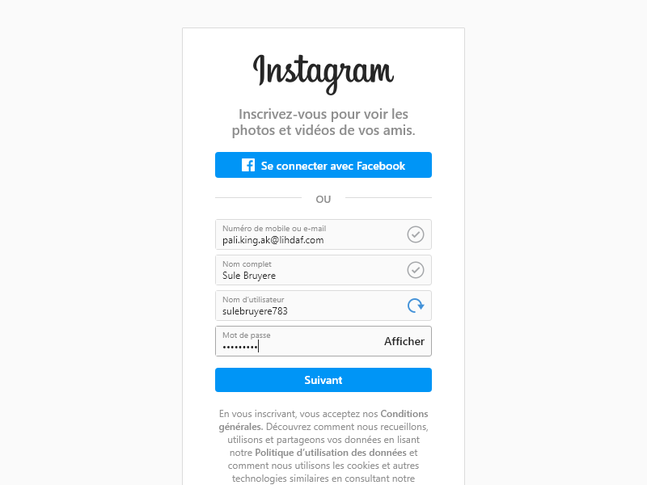

# IntagramNodeAccountCreator v2

### !! Not being maintained, feel free to fork !!

</img>

## Update

- New email handler because the older version don't work anymore
- Proxy handler
- See the creation in the browser

## Description

Create with node.js a lot of instagram accounts

## How to install ?

Launch "install.bat" or do "npm install"

## How to start ?

Launch "start.bat" or do "node index.js"

## How to get the results ?

Results go in "results" folder

## How to configure the project ?

- See config.js file

```js
 const config = {
    proxy: false, //Use a proxy each time it will create a new account ?
    headless: true, //See the creation of the account in the browser
    nbAccount: 1 //Number of account to create
}
```